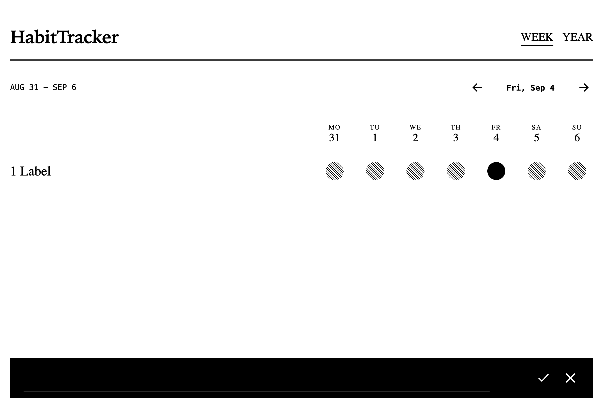
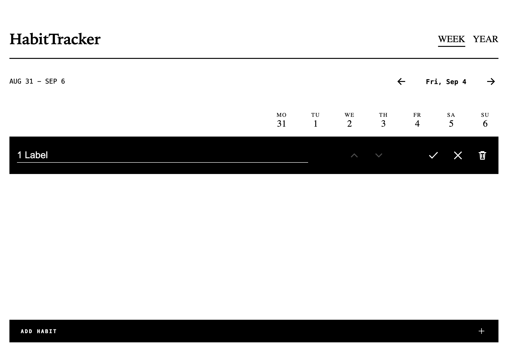
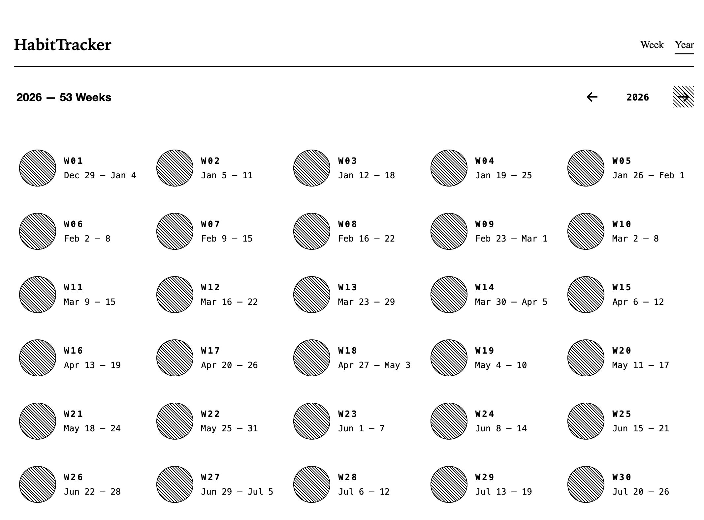

# HabitTracker

A local-first, offline habit tracker built for e-ink/e-paper tablets (Onyx Boox and similar
Android devices). No backend, no network calls, no account — everything lives on the device in
IndexedDB. The interface is deliberately minimal: high-contrast black and white, no animations or
transitions, and a small, fixed feature set so it stays fast and legible on a slow-refresh screen.

## Features

- **Weekly habit table** — a Monday–Sunday grid of circles per habit. Tap a day to mark it done;
  filled means completed, empty means not yet, and a diagonally hatched circle marks days before
  the habit existed (locked, non-interactive). Days in the future are shown as empty, disabled
  circles you can't accidentally check off ahead of time.
- **Week navigation** — step backward and forward a week at a time; you can't navigate into the
  future.
- **Add, rename, reorder, archive** — habits are managed inline in the table: click a label to open
  an editable row with move-up/down, save, cancel, and archive actions.
- **Yearly progress overview** — a full-year grid of week cards. Each card shows the week number,
  its date range, and a circle whose fill height represents the pooled completion share across all
  habits active that week. Weeks with no active habit are shown hatched instead of at 0%.
- **PWA / offline-first** — installable, works fully offline, no server component.

## Use cases

- Track a small number of daily habits (reading, exercise, meditation, etc.) on a dedicated e-ink
  tablet kept on a desk or nightstand, without draining battery on animations or backlight.
- Review the past week at a glance to catch missed days before they pile up.
- Look back over a full year to see which weeks/seasons habits held up versus lapsed.

## Recommended number of habits

The app caps active habits at **5** (`MAX_ACTIVE_HABITS` in
[`src/hooks/use-habits.hook.ts`](src/hooks/use-habits.hook.ts)) — once you hit the limit, adding
more is blocked until you archive one. This isn't just an implementation detail: tracking 5–6
habits is roughly the point where daily check-ins stay quick and the weekly view stays readable on
a small e-ink screen. Consistently checking off a handful of habits for 18–66 days is enough for
them to start feeling automatic.

## Screenshots

Weekly dashboard — tracking a habit for the current week:


Adding a new habit:



Editing an existing habit — rename, reorder, or archive:



Yearly overview — one card per week, hatched where no habit was active yet:



## Architecture

- **React 19 + Vite**, routed with `react-router` between two views: the weekly `DashboardView` and
  the `YearlyView`.
- **Dexie over IndexedDB** ([`src/db`](src/db)) is the only persistence layer — two tables,
  `habits` (identity/order/created/archived) and `fulfillments` (per-day check-ins keyed by
  `habitId` + date). `dexie-react-hooks`' `useLiveQuery` keeps views in sync with the database
  automatically, no manual refetching.
- **Hooks own the domain logic** ([`src/hooks`](src/hooks)): `useHabits` for CRUD/ordering/limit
  enforcement and toggling completions for a given week, `useYearlyProgress` for pooling
  completions into per-week percentages.
- **Components are e-ink-first**: everything is built from `@marcomattes/epaper-components`
  (`<e-*>` custom elements) wrapped in `src/components`, so styling and accessibility stay
  consistent, with no CSS animations or transitions anywhere in the app.
- **PWA**: `vite-plugin-pwa` precaches the app shell for full offline use.

## Development

```bash
npm run dev        # vite dev server on http://localhost:9001
npm run build       # tsc -b && vite build
npm run lint         # biome lint .
npm run format      # biome format --write .
npm run check       # biome check --write . (lint + format)
npm test            # vitest (watch mode)
npm run test:ui     # vitest --ui
npm run coverage    # vitest run --coverage
```
